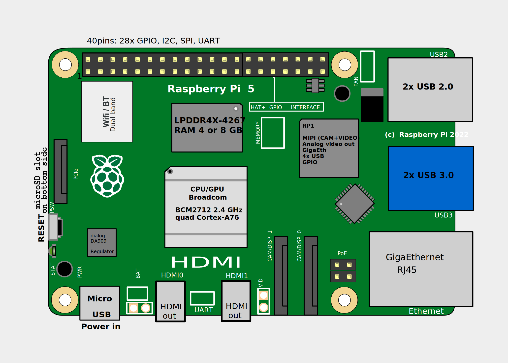

# Raspberry Pi 5 Model B (64-bit)

[](https://circleci.com/gh/nerves-project/nerves_system_rpi5)
[](https://hex.pm/packages/nerves_system_rpi5)

This is the base Nerves System configuration for the Raspberry Pi 5 Model B.


<br><sup>[Efa / Wikimedia Commons / CC BY-SA
4.0](https://en.wikipedia.org/wiki/Raspberry_Pi#/media/File:RaspberryPi_5B.svg)</sup>

| Feature              | Description                      |
| -------------------- | -------------------------------- |
| CPU                  | 2.4 GHz quad-core Cortex-A76     |
| Memory               | 4 GB or 8 GB DRAM                |
| Storage              | MicroSD                          |
| Linux kernel         | 6.1 w/ Raspberry Pi patches      |
| IEx terminal         | HDMI and USB keyboard (can be changed to UART) |
| GPIO, I2C, SPI       | Yes - [Elixir Circuits](https://github.com/elixir-circuits) |
| ADC                  | No                               |
| PWM                  | Yes, but no Elixir support       |
| UART                 | 1 available - `ttyS0`            |
| Display              | HDMI or 7" RPi Touchscreen       |
| Camera               | Official RPi Cameras (libcamera) |
| Ethernet             | Yes                              |
| WiFi                 | Yes - VintageNet                 |
| Bluetooth            | Untested                         |
| Audio                | HDMI/Stereo out                  |

## Using

The most common way of using this Nerves System is create a project with `mix
nerves.new` and to export `MIX_TARGET=rpi5`. See the [Getting started
guide](https://hexdocs.pm/nerves/getting-started.html#creating-a-new-nerves-app)
for more information.

If you need custom modifications to this system for your device, clone this
repository and update as described in [Making custom
systems](https://hexdocs.pm/nerves/customizing-systems.html).

## Supported WiFi devices

The base image includes drivers for the onboard Raspberry Pi 5 WiFi module
(`brcmfmac` driver).

## Camera

This system supports the official Raspberry Pi camera modules via
[`libcamera`](https://libcamera.org/). The `libcamera` applications are included so it's
possible to replicate many of the examples in the official [Raspberry Pi Camera
Documentation](https://www.raspberrypi.com/documentation/computers/camera_software.html).

Here's an example commandline to run:

```elixir
cmd("libcamera-jpeg -n -v -o /data/test.jpeg")
```

On success, you'll get an image in `/data` that you can copy off with `sftp`.

Since `libcamera` is being used instead of MMAL, the Elixir
[picam](https://hex.pm/packages/picam) library won't work.

## Audio

The Raspberry Pi has many options for audio output. This system supports the
HDMI and stereo audio jack output. The Linux ALSA drivers are used for audio
output.

The general Raspberry Pi audio documentation mostly applies to Nerves. For
example, to force audio out the HDMI port, run:

```elixir
cmd("amixer cset numid=3 2")
```

Change the last argument to `amixer` to `1` to output to the stereo output jack.

## Provisioning devices

This system supports storing provisioning information in a small key-value store
outside of any filesystem. Provisioning is an optional step and reasonable
defaults are provided if this is missing.

Provisioning information can be queried using the Nerves.Runtime KV store's
[`Nerves.Runtime.KV.get/1`](https://hexdocs.pm/nerves_runtime/Nerves.Runtime.KV.html#get/1)
function.

Keys used by this system are:

Key                    | Example Value     | Description
:--------------------- | :---------------- | :----------
`nerves_serial_number` | `"12345678"`      | By default, this string is used to create unique hostnames and Erlang node names. If unset, it defaults to part of the Raspberry Pi's device ID.

The normal procedure would be to set these keys once in manufacturing or before
deployment and then leave them alone.

For example, to provision a serial number on a running device, run the following
and reboot:

```elixir
iex> cmd("fw_setenv nerves_serial_number 12345678")
```

This system supports setting the serial number offline. To do this, set the
`NERVES_SERIAL_NUMBER` environment variable when burning the firmware. If you're
programming MicroSD cards using `fwup`, the commandline is:

```sh
sudo NERVES_SERIAL_NUMBER=12345678 fwup path_to_firmware.fw
```

Serial numbers are stored on the MicroSD card so if the MicroSD card is
replaced, the serial number will need to be reprogrammed. The numbers are stored
in a U-boot environment block. This is a special region that is separate from
the application partition so reformatting the application partition will not
lose the serial number or any other data stored in this block.

Additional key value pairs can be provisioned by overriding the default
provisioning.conf file location by setting the environment variable
`NERVES_PROVISIONING=/path/to/provisioning.conf`. The default provisioning.conf
will set the `nerves_serial_number`, if you override the location to this file,
you will be responsible for setting this yourself.

## Linux kernel and RPi firmware/userland

There's a subtle coupling between the `nerves_system_br` version and the Linux
kernel version used here. `nerves_system_br` provides the versions of
`rpi-userland` and `rpi-firmware` that get installed. I prefer to match them to
the Linux kernel to avoid any issues. Unfortunately, none of these are tagged by
the Raspberry Pi Foundation so I either attempt to match what's in Raspbian or
take versions of the repositories that have similar commit times.

## Linux kernel configuration

The Linux kernel compiled for Nerves is a stripped down version of the default
Raspberry Pi Linux kernel. This is done to remove unnecessary features, select
some Nerves-specific features like F2FS and SquashFS support, and to save space.

